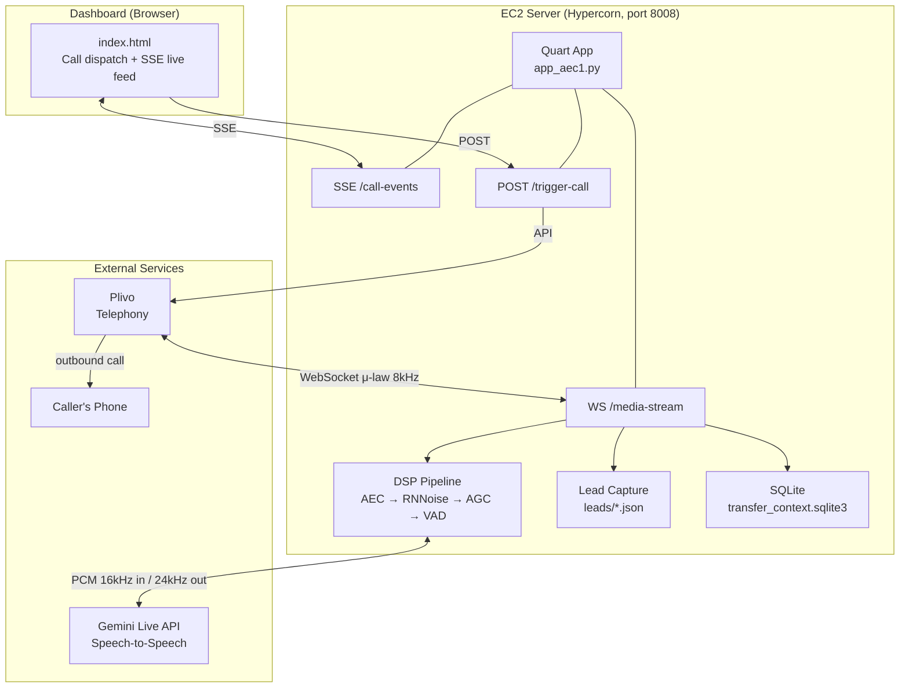
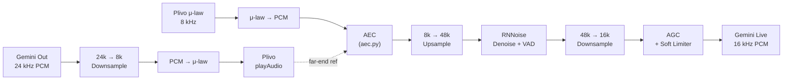

# AU-Admission-Assist — Full Project Analysis

## Overview

This is an **outbound AI voice agent** named **"Neha"** for **Adamas University (Kolkata)** admissions. It makes phone calls to prospective applicants via **Plivo** telephony, streams bidirectional audio through a real-time WebSocket to the **Google Gemini Live API** for speech-to-speech conversation. The agent informs callers about School of Engineering & Technology (SOET) programs, qualifies them as admission leads, and can hand off to a human counselor.

> [!IMPORTANT]
> The project was forked from a **Senco Gold** jewelry voice agent and reshaped for university admissions. Several legacy Senco files remain in the repo but are **no longer used at runtime**.

---

## Project Structure

| File / Directory | Role | Status |
|---|---|---|
| [`app_aec1.py`](file:///home/ubuntu/AU-Admission-Assist/app_aec1.py) | **Live/authoritative server** — the only backend deployed to EC2 | ✅ Active (2,118 lines) |
| [`prompt1.txt`](file:///home/ubuntu/AU-Admission-Assist/prompt1.txt) | **System prompt** — Neha's persona, knowledge base, conversational rules | ✅ Active (117 lines) |
| [`aec.py`](file:///home/ubuntu/AU-Admission-Assist/aec.py) | **Acoustic Echo Canceller** — pure-numpy PFDKF filter + residual suppressor | ✅ Active (256 lines) |
| [`index.html`](file:///home/ubuntu/AU-Admission-Assist/index.html) | **Live dashboard** — call dispatch UI with SSE real-time event feed | ✅ Active (1,029 lines) |
| [`CLAUDE.md`](file:///home/ubuntu/AU-Admission-Assist/CLAUDE.md) | Project documentation / coding guide | ✅ Reference |
| [`BACKEND_LIFECYCLE_CHANGES_REPORT.md`](file:///home/ubuntu/AU-Admission-Assist/BACKEND_LIFECYCLE_CHANGES_REPORT.md) | Changelog for the reliability overhaul done on the Senco-era `app.py` | ✅ Reference |
| [`requirements.txt`](file:///home/ubuntu/AU-Admission-Assist/requirements.txt) | Python dependencies | ✅ Active |
| `playback_audio_files/` | Pre-recorded WAV files (disclaimer, transfer, reconnecting, ring, no-agent) | ✅ Active |
| [`app.py`](file:///home/ubuntu/AU-Admission-Assist/app.py) | **Old/legacy server** — NOT used, not deployed | 🟡 Legacy (2,056 lines) |
| [`prompt.txt`](file:///home/ubuntu/AU-Admission-Assist/prompt.txt) | Old Senco-era system prompt | 🟡 Legacy |
| [`chromadb_setup.py`](file:///home/ubuntu/AU-Admission-Assist/chromadb_setup.py), [`groqLLM.py`](file:///home/ubuntu/AU-Admission-Assist/groqLLM.py), [`pinsearcher.py`](file:///home/ubuntu/AU-Admission-Assist/pinsearcher.py), [`phone_modifier.py`](file:///home/ubuntu/AU-Admission-Assist/phone_modifier.py) | Senco-era utility scripts | 🔴 Dead code |
| [`senco_llm4.json`](file:///home/ubuntu/AU-Admission-Assist/senco_llm4.json), [`senco_stores.csv`](file:///home/ubuntu/AU-Admission-Assist/senco_stores.csv), [`details.txt`](file:///home/ubuntu/AU-Admission-Assist/details.txt) | Senco-era data files | 🔴 Dead code |
| `senco.png`, `Blue sphere.jpeg`, `atc.png`, `favicon.png` | Image assets | Mixed use |
| [`requirements_new.txt`](file:///home/ubuntu/AU-Admission-Assist/requirements_new.txt) | Alternate/full dependency snapshot | 🟡 Unclear |

---

## Architecture



### Call Lifecycle (per WebSocket connection)

1. **`POST /trigger-call`** — dashboard dispatches an outbound call via Plivo API
2. **`/outbound-webhook`** — Plivo answer URL returns XML with a bidirectional `<Stream>` (μ-law 8kHz) pointing at `wss://…/media-stream`
3. **`@app.websocket('/media-stream')`** — the heart of the system:
   - Waits for Plivo's `start` event
   - Plays a legal disclaimer from [`recorded1.wav`](file:///home/ubuntu/AU-Admission-Assist/playback_audio_files/recorded1.wav)
   - Opens a Gemini Live session with [system prompt](file:///home/ubuntu/AU-Admission-Assist/prompt1.txt)
   - Runs **4 concurrent asyncio tasks**:

| Task | Responsibility |
|---|---|
| `stream_plivo_to_gemini` | Inbound audio: μ-law → PCM, AEC → RNNoise → AGC → VAD → Gemini |
| `stream_gemini_to_plivo` | Gemini events: audio chunks, transcripts, tool calls, usage/cost |
| `send_plivo_audio` | Paces Gemini's 24kHz audio out to Plivo as 8kHz μ-law 20ms frames |
| `supervise_call` | Watchdogs: max call duration, model-response deadline |

### Audio / DSP Pipeline



Key rates: **Plivo 8kHz μ-law** ↔ **Gemini 16kHz PCM in / 24kHz PCM out**

### Gemini Tools (Function Calling)

Only **2 tools** are active:

| Tool | Trigger | Action |
|---|---|---|
| `endCall(summary_of_whole_call)` | Model speaks farewell | Saves lead as JSON, hangs up Plivo call |
| `transferCall(call_summary, language)` | User asks for human | Stores context in SQLite, Plivo transfers to `HUMAN_TRANSFER_NUMBER`, on dial-end re-enters `/media-stream` to resume AI |

Both defer execution via [`execute_pending_terminal_action`](file:///home/ubuntu/AU-Admission-Assist/app_aec1.py#L1861-L1959) until closing audio has drained, so the agent is never cut off mid-sentence.

### Session Resumption

The system handles Gemini **GoAway** signals and unexpected disconnects gracefully:
- Stores a session resumption handle from Gemini
- Reconnects up to `MAX_GEMINI_RECONNECTS` (default 5) times
- Resets transient state but preserves the learned AEC filter weights across reconnects

---

## System Prompt Design ([`prompt1.txt`](file:///home/ubuntu/AU-Admission-Assist/prompt1.txt))

The prompt is well-structured with clear sections:

- **Role & Objective** — "Neha", warm outbound admission agent for SOET 2026 session
- **Language & Tone** — Dynamic language matching (English / Hinglish / Benglish), numbers always in English
- **Knowledge Base** — 14 undergraduate programs (B.Tech + BCA) and 3 postgraduate programs (M.Tech + MCA) with exact first-semester and total fees, eligibility criteria
- **Conversational Rules** — 9-step structured flow (greeting → language → consent → student/parent → academic profile → program interest → Q&A → handoff → closing)
- **Guardrails** — No hallucination, no WBJEE/JEE demand for B.Tech, no competitor mentions, identity protection

> [!NOTE]
> `{user_name}` and `{phone_number}` are `.format()`-substituted per call. Stray `{` / `}` in the prompt would break this.

---

## Dependencies ([`requirements.txt`](file:///home/ubuntu/AU-Admission-Assist/requirements.txt))

| Package | Version | Purpose |
|---|---|---|
| `plivo` | 4.59.6 | Telephony API (outbound calls, WebSocket streams) |
| `google-genai` | 1.66.0 | Gemini Live API (speech-to-speech) |
| `Quart` | 0.20.0 | Async web framework (HTTP + WebSocket) |
| `Hypercorn` | 0.18.0 | ASGI server |
| `pyrnnoise` | 0.4.3 | Noise suppression + VAD probability |
| `numpy` | 2.2.6 | Audio DSP, AEC math |
| `python-dotenv` | 1.2.2 | `.env` file loading |
| `chromadb` | 1.5.8 | 🔴 Legacy (unused at runtime) |
| `groq` | 1.2.0 | 🔴 Legacy (unused at runtime) |
| `audioop-lts` | 0.2.1 | Backport for Python ≥ 3.13 (sample rate conversion, μ-law) |

---

## Environment Variables

| Variable | Required | Notes |
|---|---|---|
| `GOOGLE_API_KEY` | ✅ | Gemini API key |
| `PUBLIC_BASE_URL` | ✅ | Public HTTPS base URL (no trailing slash) for Plivo webhooks/WSS |
| `FROM_NUMBER` | ✅ | Plivo caller ID |
| `PLIVO_AUTH_ID` / `PLIVO_AUTH_TOKEN` | ✅ | Plivo SDK credentials |
| `API_AUTH_TOKEN` | ⚠️ | Auth for `/trigger-call` (defaults to `"default-dev-token"`) |
| Various `*_SECONDS` / `*_MAX_*` | ❌ | Tuning knobs with sensible defaults |

---

## Key Observations & Risks

### Strengths
- **Robust call lifecycle** — well-coordinated async tasks with proper cancellation, deadlines, and fallback lead capture
- **Sophisticated DSP** — AEC + RNNoise + AGC + soft limiter chain handles speakerphone echo and telephony noise
- **Session resilience** — Gemini reconnection with resumption handles, GoAway handling
- **Structured lead capture** — idempotent `save_lead()` fires on endCall, transfer, and user-hangup fallback
- **Human handoff** — context preserved in SQLite across WebSocket reconnects
- **Good documentation** — `CLAUDE.md` is thorough and accurate

### Risks & Technical Debt

> [!WARNING]
> **Single-process bottleneck**: DSP runs inline in the asyncio event loop (GIL-bound, CPU-heavy). One call largely saturates one core. Multi-worker is not safe due to module-level SSE state.

> [!WARNING]
> **No test suite**: No unit tests, no integration tests, no linter configured. `python -m py_compile` is the only validation.

| Issue | Severity | Detail |
|---|---|---|
| **Dead Senco code** | Low | ~6 unused files + 2 unused pip packages (`chromadb`, `groq`) inflate the repo |

| **Hardcoded transfer number** | Low | `HUMAN_TRANSFER_NUMBER` is a constant, not env-configurable |
| **No recording callback** | Medium | `/recording-callback` URL is referenced in Plivo XML but no endpoint exists |
| **Token cost tracking** | Low | Cumulative token counting may be inaccurate (noted in BACKEND_LIFECYCLE_CHANGES_REPORT) |
| **No webhook signature validation** | Medium | Plivo webhooks are not authenticated |
| **No rate limiting** | Medium | `/trigger-call` has API key auth but no rate limit |
| **Monolithic file** | Medium | `app_aec1.py` is 2,118 lines — all routes, DSP, tools, state machine in one file |

---

## Git History

```
4ad6f5c (HEAD) Changes made for the AU admission agent
7eaab97        feat: redesign dashboard UI to editorial brutalism and integrate AEC backend
c80a902        Last working code
f1518d7        last working code
```

Only 4 commits — the project is in early prototype stage. The latest commit adapted the codebase from Senco to Adamas University.

---

## File Metrics

| File | Lines | Bytes |
|---|---:|---:|
| `app_aec1.py` | 2,118 | 100 KB |
| `app.py` (legacy) | 2,056 | 97 KB |
| `index.html` | 1,029 | 36 KB |
| `aec.py` | 256 | 11 KB |
| `prompt1.txt` | 117 | 12 KB |
| `requirements.txt` | 12 | 272 B |

---

## Summary

This is a **production-deployed, real-time voice AI agent** with a sophisticated audio pipeline, but it carries significant technical debt from its Senco origins. The core architecture (Plivo ↔ DSP ↔ Gemini Live) is well-engineered with proper error handling, session resumption, and deferred terminal actions. The main improvement areas are: cleaning up legacy files, fixing the dashboard branding, adding tests, modularizing the monolithic server file, and addressing the single-process scaling limitation.
